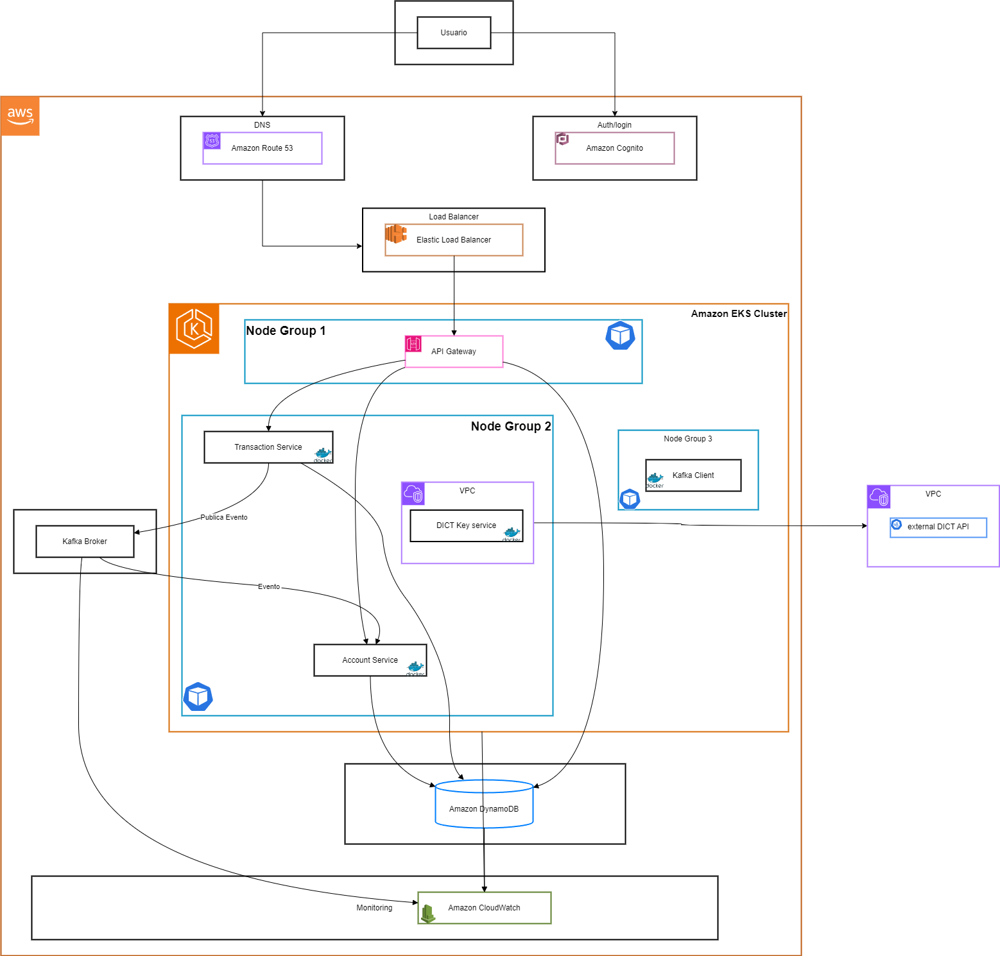

# GO Banking

**Disclaimer:** GO Banking é um projeto experimental para fins de estudo e teste. O nome é utilizado apenas neste contexto de aprendizado.

## Visão Geral

GO Banking é um serviço backend que simula uma plataforma financeira, permitindo que usuários realizem transferências entre contas de qualquer banco no Brasil, utilizando Open Finance e Pix. O serviço fornece uma visão consolidada dos saldos dos usuários e possibilita transferências entre contas.

## Objetivos

O principal objetivo deste projeto é explorar e aprender sobre desenvolvimento backend, design de sistemas e tecnologias modernas como microserviços, arquitetura orientada a eventos, Kubernetes, Docker e serviços da AWS.

## Arquitetura Atualizada

A arquitetura é baseada em microserviços, hospedada na AWS, containerizada com Docker e orquestrada com Kubernetes (AWS EKS). Com a adoção do **AWS Cognito**, o serviço de autenticação customizado foi substituído por um serviço gerenciado, simplificando a arquitetura e aumentando a segurança.

### Componentes e Serviços AWS

#### AWS Cognito

- **Descrição:** Serviço gerenciado para autenticação, autorização e gerenciamento de usuários.
- **Uso no Projeto:** Gerencia o registro, login e autenticação dos usuários. Emite tokens JWT usados para autenticação nas APIs.

#### AWS Elastic Kubernetes Service (EKS)

- **Descrição:** Serviço gerenciado de Kubernetes.
- **Uso no Projeto:** Hospeda os microserviços containerizados.

#### Docker Containers

- **Contêineres:**
  - **API Gateway Container:** Gerencia solicitações e integra-se com o Cognito para autenticação.
  - **Account Service Container:** Gerencia informações de contas e saldos.
  - **Transaction Service Container:** Lida com transações e interage com o Kafka.
  - **Event Consumer Containers:** Processam eventos do Kafka.

#### AWS Managed Streaming for Apache Kafka (Amazon MSK)

- **Descrição:** Serviço gerenciado para clusters Kafka.
- **Uso no Projeto:** Barramento de eventos para comunicação entre serviços.

#### Amazon DynamoDB

- **Descrição:** Banco de dados NoSQL.
- **Uso no Projeto:** Armazena dados de contas, transações e eventos.

#### Outros Serviços AWS

- **AWS CloudWatch:** Monitoramento e logging.
- **AWS IAM:** Controle de acesso e políticas de segurança.
- **AWS Elastic Load Balancing (ELB):** Distribuição de tráfego.
- **Amazon Route 53:** Gerenciamento de DNS.
- **AWS KMS:** Gerenciamento de chaves de criptografia.

### Arquitetura Lógica

#### Fluxo de Dados

1. **Registro/Login do Usuário:**
   - Usuário interage diretamente com o AWS Cognito para registro e login.
   - Cognito emite tokens JWT (ID token, Access token, Refresh token).

2. **Solicitações à API:**
   - Usuário faz chamadas à API incluindo o token de acesso.
   - **Amazon Route 53** resolve o domínio para o ELB.
   - **ELB** distribui o tráfego para o API Gateway no EKS.

3. **API Gateway:**
   - Configurado com o Cognito Authorizer para validar tokens JWT.
   - Roteia solicitações autenticadas para os microserviços.

4. **Microserviços:**
   - **Account Service** e **Transaction Service** processam as solicitações.
   - Utilizam informações do token JWT para autorização e identificação do usuário.
   - Interagem com o **DynamoDB** e **Kafka** conforme necessário.

5. **DICT Key Service**:
   - Consulta a **API do Banco Central** para obter detalhes da chave.

6. **Processamento de Eventos:**
   - **Transaction Service** publica eventos no **Amazon MSK (Kafka)**.
   - **Account Service** consome eventos para atualizar saldos.

7. **Persistência e Estado:**
   - **DynamoDB** armazena dados de contas, transações e eventos.

8. **Monitoramento e Logging:**
   - **AWS CloudWatch** coleta logs e métricas.

### Diagrama de Arquitetura

### Considerações de Infraestrutura

- **NAT Gateway**:
  - Necessário para que o DICT Key Service acesse a internet a partir de sub-redes privadas.
- **Grupos de Segurança**:
  - Restringir tráfego de saída do DICT Key Service.
- **Configurações de Rede**:
  - Assegurar que apenas os serviços autorizados possam comunicar-se com o DICT Key Service.

### Tecnologias Utilizadas

- **Linguagem de Programação**: Go
- **Banco de Dados**: Amazon DynamoDB
- **Message Broker**: Apache Kafka (Amazon MSK)
- **Autenticação**: AWS Cognito
- **Containerização**: Docker
- **Orquestração**: Kubernetes (AWS EKS)
- **Integração Externa**: API do Banco Central via DICT Key Service
- **Monitoramento**: AWS CloudWatch
- **Infraestrutura como Código**: AWS CloudFormation ou Terraform

## Como Executar o Projeto

*(A ser desenvolvido conforme o avanço do projeto.)*

## Notas

- **Disclaimer**: GO Banking é um projeto experimental para fins de estudo e teste.
- **Contribuições**: Sugestões e discussões sobre design e arquitetura são bem-vindas.

---

**Considerações Finais**

A integração com a API do Banco Central é essencial para validar chaves Pix e garantir a segurança e confiabilidade das transações. A adição do DICT Key Service como um microserviço dedicado permite uma arquitetura mais modular e facilita a manutenção.

---
